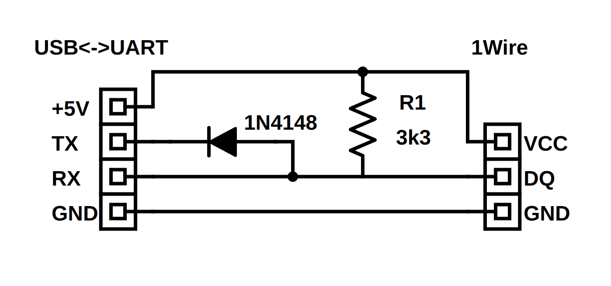

# uwb1wire

### Overview
Simple 1Wire adapter based on USB<->UART dongle. Any dongle like CP2102, FT232, CH341 and others will do.
It is better to set the voltage to 3.3V (if there is a logic level switch). When using the project in the lab,
to prevent damage to your PC, I strongly recommend using a dongle with galvanic isolation.  

The connection diagram:
<p float="left">
  
</p>

Test setup:
<p float="left">
  
</p>

Example of using the program:
```
$ ./usb1wire /dev/ttyACM0 
Open: /dev/ttyACM0
Found ROM[0]: 28 48 49 94 0C 00 00 84 
Found ROM[1]: 28 FA 0B D0 02 00 00 9D 
Found ROM[2]: 28 EE 54 10 05 00 00 A3 
Found ROM[3]: 28 C1 5B 3B 03 00 00 6B 
Init ds18b20[0] to 12Bit resolution, read TRIM1: 08, TRIM2: 74
Init ds18b20[1] to 12Bit resolution, read TRIM1: 1F, TRIM2: DB
Init ds18b20[2] to 12Bit resolution, read TRIM1: 3F, TRIM2: DB
Init ds18b20[3] to 12Bit resolution, read TRIM1: 7F, TRIM2: DB
 25.4°C  25.4°C  25.6°C  25.2°C 
 25.4°C  25.4°C  25.6°C  25.3°C 
 25.4°C  25.4°C  25.6°C  25.3°C 
 25.4°C  25.4°C  25.6°C  25.3°C 
 25.4°C  25.4°C  25.6°C  25.3°C 
 25.4°C  25.4°C  25.6°C  25.3°C 
 25.4°C  25.4°C  25.6°C  25.3°C 
```

### Requirements
gcc / g++ 13.3.0 or higher  
cmake 3.14 or higher  

### Build project
>mkdir build  
>cd build  
>cmake ..  
>make
